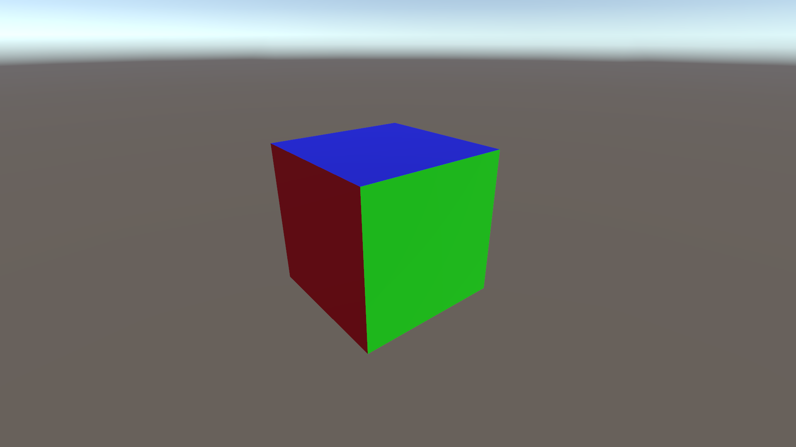
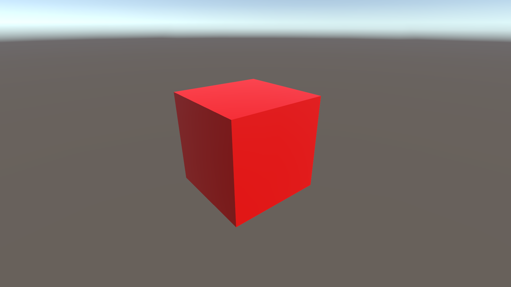

# HightlightMaterial

Selected object highlighting prototype / example. This one supports objects with multiple materials. Debug printouts tell what's happening when using this this test.

### HightlightMaterial off

### HightlightMaterial on

